import Map from '../../../components/map.astro'

Stará Ľubovňa, napriek nádhernému prostrediu, nie je pre cyklistov obzvlášť priateľská. Asfaltové cyklostrasy sú krátke a príliš kopcovité. Značené cyklotrasy pre horské bicykle sú zas takmer až výsmechom - prudké a kvôli pôsobeniu traktorov často nezjazdné.

Napriek tomu odporúčam priniesť so sebou (e)bajk, pretože výhľady vždy prekonajú útrapy. Sám som zanietený cyklista, prešiel som v okrese azda každú lesnú cestičku. Zoznam nižšie preto obsahuje starostlivo vybrané cyklotrasy, ktoré sú spravidla niečim zaujímavé (napr. výhľady, rovina, atď.). Zoznam je rozdelený do troch častí:
- [asfaltové cyklotrasy](#-asfaltové-cyklotrasy),
- [nespevnené cyklotrasy](#-nespevnené-cyklotrasy)
- [traily](#️-traily),
- a na záver [niekoľko tipov](#-tipy).

## 🚴 Asfaltové cyklotrasy

### Červený Kláštor - Lesnica (prielom Dunajca)

Jednoznačne najkrajšia cyklotrasa v okrese prechádza dychberúcim prielomom Dunajca kde si pomalou jazdou vychutnáte chládok Dunajca, plte i obrovské skalné zrazy. Nie je asfaltová (pretože sa nachádza v národnom parku), napriek tomu je tak dobre vyvalcovaná, že nie je problém ju prejsť na cestnom bicykli. Trasu si môžete okolo Dunajca predĺžiť do poľskej [Szczawnice](https://szczawnica.pl/) <Map lat="49.42762046496819" lng="20.47659742821493" />, kde nájdete neprieberné množstvo aktivít pre deti aj dospelých. Späť tou istou trasou alebo cez [Lesnické sedlo](https://sk.mapy.cz/s/katajuhuho) (asfalt, hlavná cesta, ťažká, nádherné výhľady na Tatry a Tri Koruny), či [Targov](https://sk.mapy.cz/s/bekadelake) (poľná, veľmi ťažká, výhľady na Tri Koruny).

- 8.7km
- prevýšenie 68m (rovina s jedným kopčekom)
- [interaktívna mapa](https://sk.mapy.cz/s/mopadefamu)
- začiatok: Červený Kláštor <Map lat="49.395247" lng="20.419533" /> 
- koniec: Lesnica - chata Pieniny <Map lat="49.412390" lng="20.457232" />
- 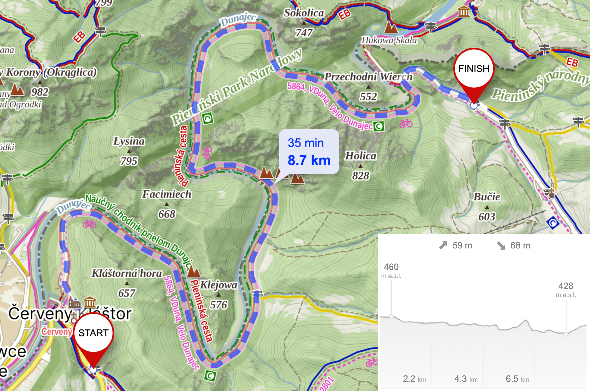

### Stará Ľubovňa - Hniezdne

Dobrý spôsob ako sa dostať z mesta do Nestville Parku. Vhodná pre deti. Po ceste môžete obdivovať výhľady na Tatry. Cyklotrasa zvykne byť dosť plná, dávajte si pozor obzvlásť v neprehľadných zákrutách a jazdite iba vo svojom pruhu. Späť tou istou trasou.

- 4.1km
- prevýšenie 16m (rovina s jedným kopčekom)
- [interaktívna mapa](https://sk.mapy.cz/s/mubecuroma)
- začiatok: Kaufland, Stará Ľubovňa <Map lat="49.305816" lng="20.684558" />
- koniec: Nestville Park, Hniezdne <Map lat="49.301370" lng="20.640731" />
- 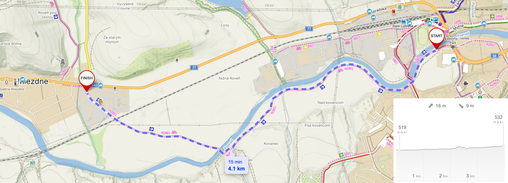

### Nová Ľubovňa - Ľubovnianske kúpele

Najobľúbenejšia trasa lokálnych športovcov umožňuje navštíviť Ľubovnianske kúpele relatívne nenáročným kopcom, cez tiché prostredie a s peknými výhľadmi na Ľubovniansku vrchovinu a dolinu rieky Poprad. Po ceste môžete navštíviť [Poľnú saunu](/polna-sauna) (potrebná rezervácia vopred). Pred cestou si dobre skontrolujte brzdy, zjazd je veľmi prudký (20% sklon). Pozrite si samostatnú stránku [aktivít v Ľubovnianskych kúpeľoch](/lubovnianske-kupele). Späť tou istou trasou alebo [cez Chmeľnicu](https://sk.mapy.cz/s/hahufuhata) (krajnica na hlavnej ceste je veľmi široká a bezpečná).

- 5.2km
- prevýšenie 159m (stredná náročnosť - 5% z Novej Ľubovne, 20% (!) z Ľubovnianskych kúpeľov)
- [interaktívna mapa](https://en.mapy.cz/s/robokopoka)
- začiatok: Nová Ľubovňa <Map lat="49.277347" lng="20.686842" />
- koniec: Ľubovnianske kúpele - pramene <Map lat="49.262075" lng="20.728490" />
- 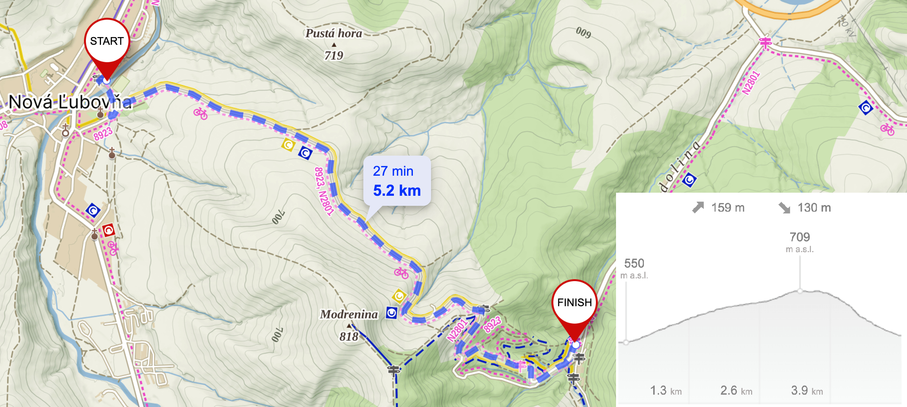

### Mníšek nad Popradom - Sulín

Spoznať povodie Popradu je najľahšie cyklotrasou medzi najnižšími obcami okresu. Trasa je súčasťou [Eurovelo 11](https://www.eurovelo11.sk/) a ponúka nenáročnú cykloturistiku s výhľadmi na poľský Popradzki Park Krajobrazowy. Tesne pred koncom sa určite osviežte pri studničke <Map lat="49.37940954591856" lng="20.758888900803456" />, prípadne si trasu predĺžte až k prameňu známej [Sulínky](https://sulinka.sk/) <Map lat="49.3612084900383" lng="20.781746638649675" /> či dokonca [cez Legnavu](https://en.mapy.cz/s/hudotafona) do Muszyny <Map lat="49.34607138416113" lng="20.88364581739777" /> - známej poľskej turistickej destinácie. Späť tou istou trasou.

- 8.7km
- prevýšenie 30m (rovina)
- [interaktívna mapa](https://en.mapy.cz/s/gotufunopu)
- začiatok: Mníšek nad Popradom <Map lat="49.41653748341332" lng="20.721290246306577" />
- koniec: Sulín <Map lat="49.37011921019785" lng="20.762050097559765" />
- 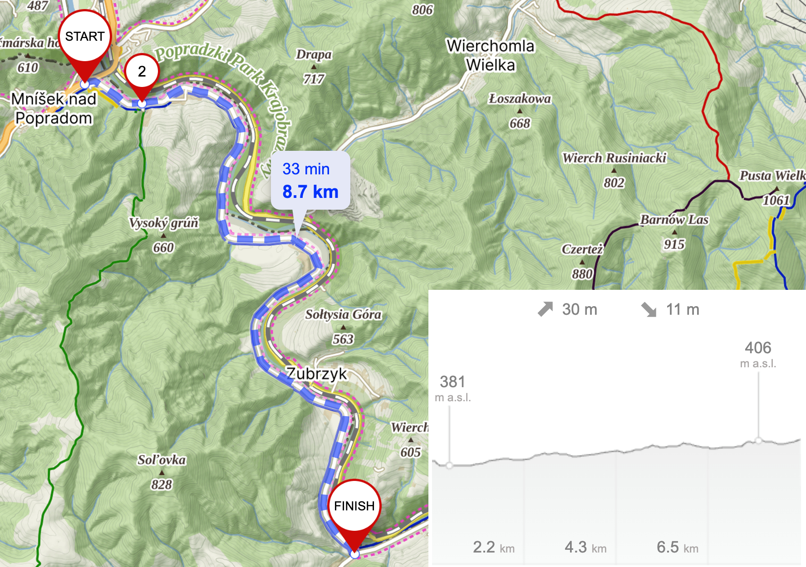

### Údol - Plaveč

Cyklotrasa odnikiaľ nikam s extrémne prudkým kopcom. Často cez ňu prechádza dobytok a zanecháva ju značne špinavú. Na vrchole je však [vyhliadková veža](/vyhliadky) <Map lat="49.28563460544582" lng="20.812727903118382" /> vďaka ktorej vidíte okolo seba takmer celý Ľubovniansky okres. Skvelé miesto na tréning v tichu, no na rekreáciu bez ebajku neodporúčam. Späť tou istou trasou.

- 3.8km
- prevýšenie 122m (prudké z oboch strán - 10% z Údola, 8% z Plavča)
- [interaktívna mapa](https://sk.mapy.cz/s/jemonogoko)
- začiatok: Údol <Map lat="49.290413" lng="20.804238" />
- koniec: Plaveč <Map lat="49.266485" lng="20.840946" />
- 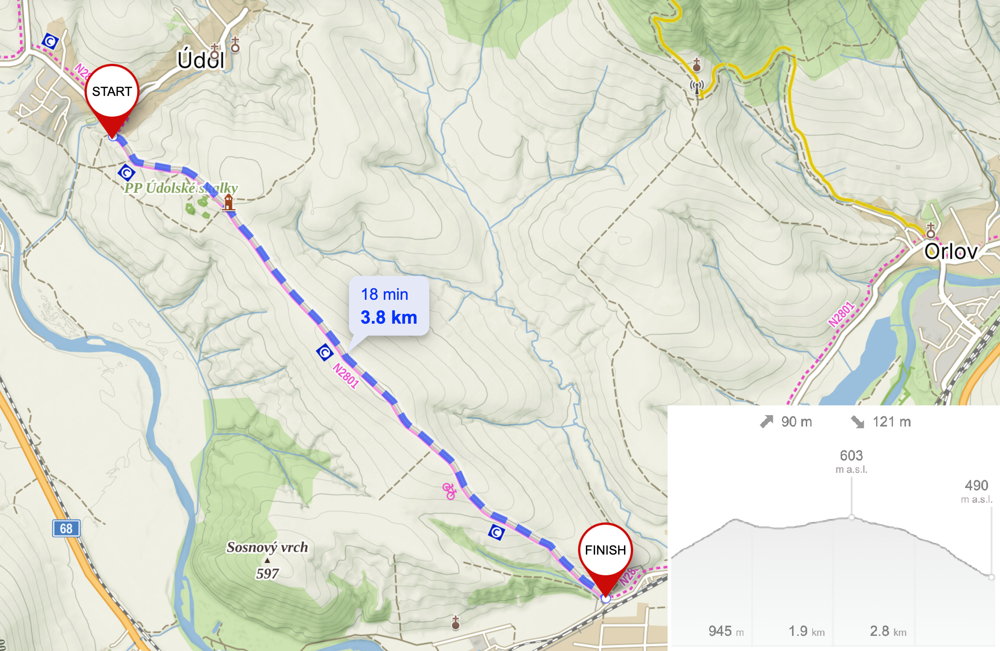

### Stará Ľubovňa - Chmelnica

Slúži Chmelničanom na bezpečný presun do Starej Ľubovne. Vhodná pre deti. Po ceste nie je nič zaujímavé, uvádzam ju len pre úplnosť. Ak ju však prejdete na horských bicykloch, môžete si ju predĺžiť k [Čertovej skale](/certova-skala-chmelnica). Späť tou istou trasou alebo po hlavnej ceste (krajnica je veľmi široká a bezpečná).

- 1.9km
- prevýšenie 18m (rovina s jedným kopčekom)
- [interaktívna mapa](https://sk.mapy.cz/s/gafavovabu)
- začiatok: Podsadek, Stará Ľubovňa <Map lat="49.308324" lng="20.708050" />
- koniec: Chmelnica <Map lat="49.298620" lng="20.726334" />
- 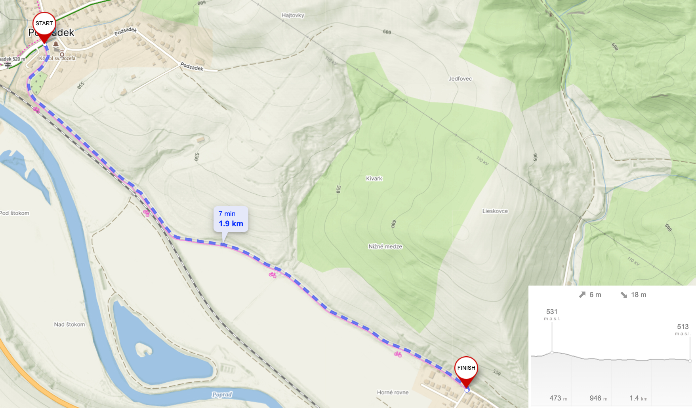

## 🚵 Nespevnené cyklotrasy

### Kotník

Najviditeľnejší vysielač okresu síce neponúka výhľady, ale zjazd si užije každý skúsenejší cyklista. Prudké vlny, lesné cestičky či záverečná poľná cesta bez brzdenia. Príjazd zo Starej Ľubovne dáva možnosť spoznať zákutia rieky Poprad, zatiaľ čo počas zjazdu je možné nakuknúť na okraj Levočských vrchov. Pozor však na dážď, niektoré blatisté úseky schnú aj týždeň.

- 26.1km
- prevýšenie 414m (rovina s jedným veľmi ťažkým kopcom)
- [interaktívna mapa](https://sk.mapy.cz/s/cozefotopu)
- začiatok: Kaufland, Stará Ľubovňa <Map lat="49.305816" lng="20.684558" />
- koniec: Kaufland, Stará Ľubovňa <Map lat="49.305816" lng="20.684558" />
- 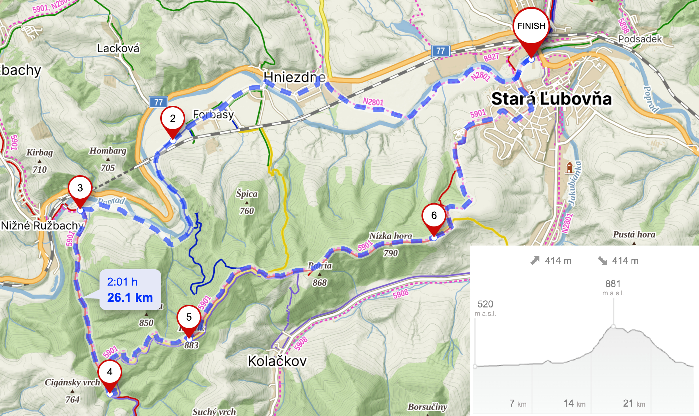

### Chata Poľana

Najjazdenejší okruh Levočských vrchov. Väčšina trasy vedie po starých asfaltových cestách, no paradoxne najkrajšia časť (okolo chaty Poľana) nie. Príroda nám to však veľmi rada vykompenzuje výhľadmi na Tatry aké inde nezažijete - uvidíte dolinu Popradu v celej jej kráse od Podolínca až po Starú Ľubovňu. Trasu je možné skrátiť len po chatu Poľana a vrátiť sa tou istou cestu späť, no ticho a krásne výhľady rozhodne stoja za pokračovanie v okruhu.

- 43.5km
- prevýšenie 829m (ťažká trasa)
- [interaktívna mapa](https://sk.mapy.cz/s/navutagaho)
- začiatok: Nová Ľubovňa <Map lat="49.276146" lng="20.683590" />
- koniec: Nová Ľubovňa <Map lat="49.276146" lng="20.683590" />
- 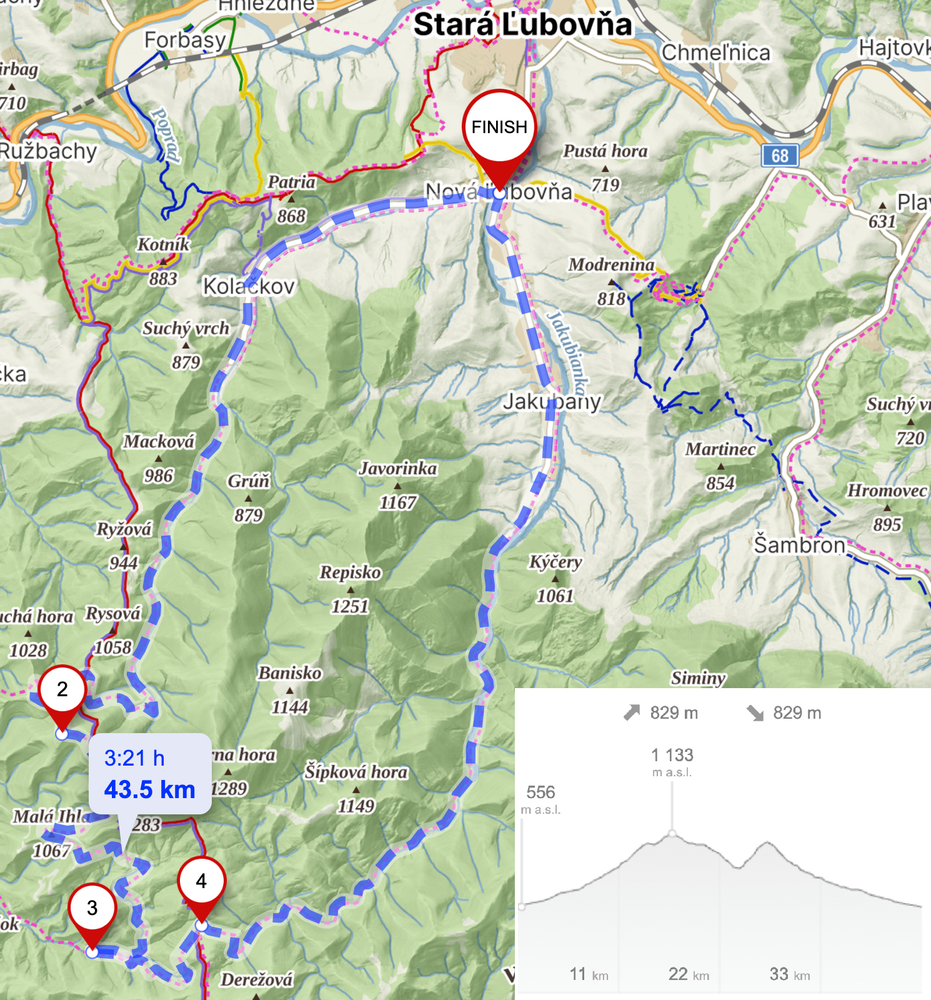

### Hrebeň Ľubovnianskej vrchoviny

Aké iné kopce by mohli najviac reprezentovať okolie Starej Ľubovne ak nie Ľubovnianska vrchovina. Sú to neveľké pahorky severo-východne od mesta, ktoré dovoľujú zazrieť do neturistických (a autentických) častí okresu. Táto trasa vás prevedie všetkým zaujímavým - od [lesoparku](/lesopark) pri [hrade](/hrad-lubovna), cez prístupovú cestu k [Cyklostopám](/cyklostopy), sedlo Marmon s pamätníkom padnutému lietadlu, otvorený hrebeň vrchoviny s výhľadmi, až po [Čertovu skalu](/certova-skala-chmelnica).

- 24.2km
- prevýšenie 503m (stredná náročnosť)
- [interaktívna mapa](https://sk.mapy.cz/s/durudatago)
- začiatok: Lesopark, Stará Ľubovňa <Map lat="49.320693" lng="20.692717" />
- koniec: Lesopark, Stará Ľubovňa <Map lat="49.320693" lng="20.692717" />
- 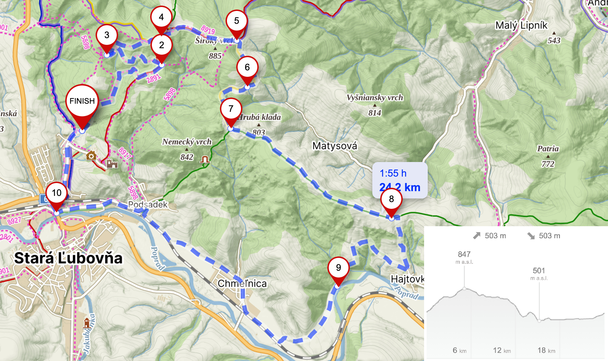

### Veterný vrch

Najvyšší vrch severnej časti Spišskej Magury je odlesnený a preto ponúka jedinečné výhľady na všetky strany. Na jednom mieste vidíte Belianske Tatry, Pieniny (s Troma Korunami), Ľubovniansky hrad, no tiež Beskydy, Levočské vrchy a z diaľky aj Čergov. Na vrchole vás privíta medveď s vlajkou a jeho lavička. Väčšina trasy vedie cez starú nepoužívanú asfaltovú cestu priamo skrz Spišskú Maguru, takže si pri monotónnom šľapaní oddýchnete v tichu a čerstvom vzduchu. Je možné sa vrátiť tou istou trasou, či pokračovať k Pieninám. V polovici cesty sa môžete občerstviť v [Penzióne Daniella](https://penziondaniella.sk/) <Map lat="49.37482567362676" lng="20.49654437899341" />. Trasa končí v kúpeľnej dedinke Vyšné Ružbachy, kde nájdete množstvo príležitostí na relax po ťažkej cyklotúre. Zrelaxujte napríklad pri [kráteri](/ruzbassky-krater), na horskom kúpalisku <Map lat="49.305305185471994" lng="20.55437094640797" /> alebo si vyberte jeden z wellnessov v hoteloch a penziónoch.

- 39.1km
- prevýšenie 859m (ťažká trasa)
- [interaktívna mapa](https://en.mapy.cz/s/dubegureju)
- začiatok: Vyšné Ružbachy <Map lat="49.29957727429058" lng="20.564444705255973" />
- koniec: Vyšné Ružbachy <Map lat="49.29957727429058" lng="20.564444705255973" />
- 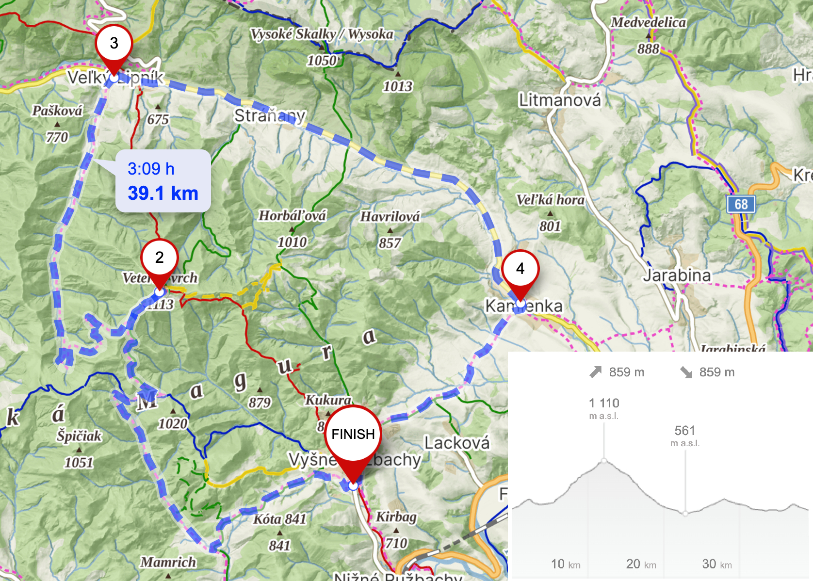

## 🚵⤵️ Traily

### Cyklostopy

Klenot pre všetkých nadšencov singletrailov sa skrýva v lesoch nad [hradom Ľubovňa](/hrad-lubovna). Cyklostopy ponúkajú 8 trailov rôznej náročnosti pre každého cyklistu. Samozrejmosťou je výstupovka a altánok s ohniskom na štarte. Prístup je možný aj po nenáročnej asfaltovej ceste a miesta na parkovanie je dostatok. Všetko, vrátane fotiek a mapy nájdete na webe [cyklostopy.sk](https://www.cyklostopy.sk/) alebo na [samostatnej stránke](/cyklostopy) na tomto webe. Po dobrej jazde je možné si oddýchnuť v [lesoparku](/lesopark).

### Singletrails Lechnica

Žiaľ, už neudržiavané, no nádherné poľné traily s výhľadmi na Pieniny. Stále je možné zjazdiť Griftof aj Špicu, hoci niektoré mostíky sú už popadané. Mapa je k dispozícii na [Trailforks](https://www.trailforks.com/region/singletrails-lechnica/?activitytype=1&z=13.0&lat=49.37286&lon=20.41013&content=trails,labels,nst,region,poi,directory,polygon,waypoint,routes_featured) alebo na tejto fotke info tabule:
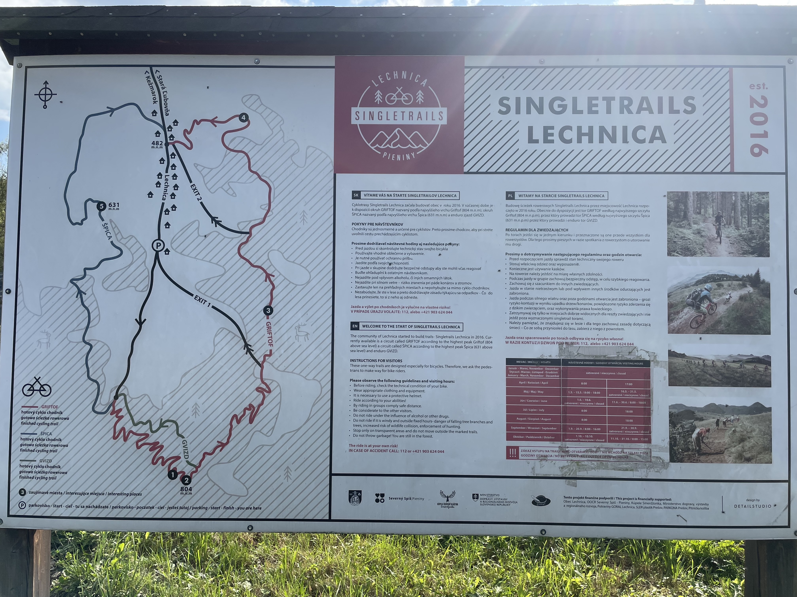

## 💡 Tipy

Na objavenie trás je najlepšie použiť [Strava Heatmap](https://www.strava.com/maps/global-heatmap) - v okrese je Strava veľmi populárna a heatmapa je veľmi výpovedná.

Následne na plánovanie trasy odporúčam [mapy.cz](https://sk.mapy.cz/) - sú najpresnejšie a majú výborný plánovač trasy. Avšak pozor - vždy výslednú trasu preverte cez Strava Heatmap, pretože niekedy nájde až príliš priame cesty cez lesy a polia, nehľadiac na terén a prevýšenie.
